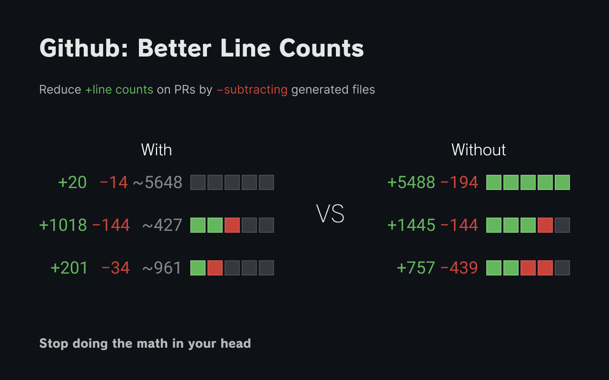

<h1> GitHub: Better Line Counts</h1>

[](https://chrome.google.com/webstore/detail/ocfdgncpifmegplaglcnglhioflaimkd) [](https://addons.mozilla.org/en-US/firefox/addon/github-better-line-counts/)



A chrome extension that removes generated files from a PR's diff count.

- `pnpm-lock.yaml`
- `package-lock.json`
- `yarn.lock`

### How does this work?

The extension uses the Github API to load information about your PR, then recalculates the diff, subtracting known generated files.

## Roadmap

- [x] `v1.0.0` Subtract a hardcoded list of generated files from PR diffs as POC
- [ ] Support private repos via GitHub PAT
- [ ] Make the list based off your `.gitattributes`
- [ ] Recalculate the 5 diff boxes next to the count

That's it. Very simple, targeted extension for fixing 1 problem with GitHub.

## Development

### Scripts

This extension is bundled via `vite-plugin-web-extension`.

- `pnpm dev`: Launchs Chrome with the dev version of the extension installed.
- `pnpm build`: Builds the extension for production. Outputs to the `dist` directory.
- `pnpm zip`: Zips up the `dist` directory into an installable ZIP file.

Add `:firefox` suffix to some commands to target firefox instead of Chrome.

- `pnpm build:firefox`
- `pnpm dev:firefox`

### Auto-imports

This extension also uses `unplugin-auto-import` to make some imports available without writing the import statement.

For Typescript to work properly in your editor, `unplugin-auto-import` generates a declaration file at: `src/@types/auto-imports.d.ts`. You must run `pnpm build` to create this file before types will work properly.

### Running Tests

Unit tests are written with Vitest.

```ts
pnpm test
```
